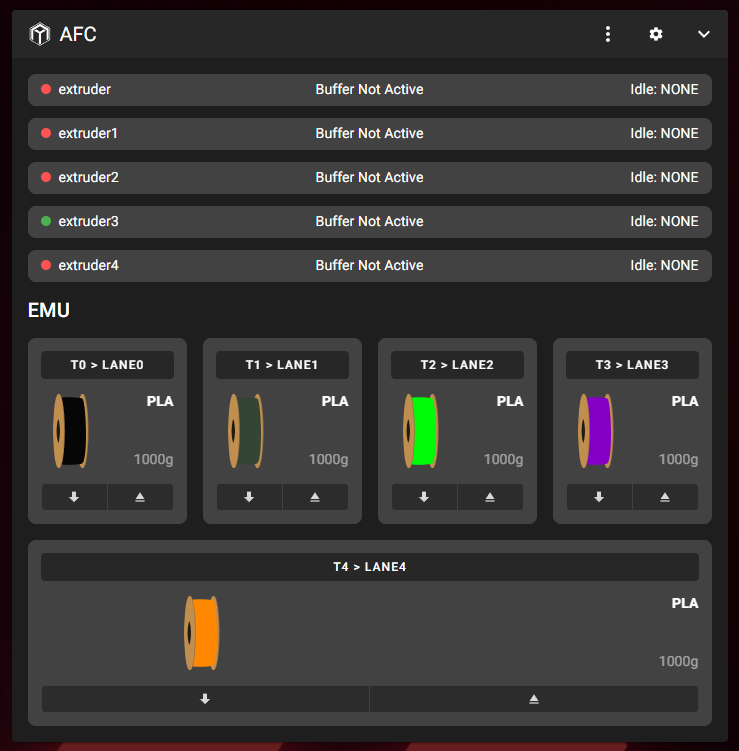

# AFC EMU MMU Setup — 5 Lanes, 5 Toolheads, Direct Mode

This guide covers setting up a 5-lane [EMU](https://github.com/DW-Tas/EMU) MMU with
[AFC-Klipper-Add-On](https://github.com/AFCProject/AFC-Klipper-Add-On) on a Klipper
printer that uses [Klipper Toolchanger](https://github.com/viesturz/klipper-toolchanger)
with **5 independent toolheads** — one lane feeds one toolhead directly, with no
central hub in between ("Direct Mode").

All config files referenced here live in [`config/AFC/`](../config/AFC/) in this
repository and can be used as a starting point — **every pin, IP address, and
calibration value must be adjusted to your own hardware.**

## Table of contents

1. [Architecture overview](#1-architecture-overview)
2. [Folder structure](#2-folder-structure)
3. [Hardware wiring & pin mapping](#3-hardware-wiring--pin-mapping)
4. [AFC core configuration](#4-afc-core-configuration)
5. [Toolchanger & toolhead configuration](#5-toolchanger--toolhead-configuration)
6. [Lane configuration (steppers, sensors, buffers)](#6-lane-configuration-steppers-sensors-buffers)
7. [Using the buffer as a toolhead ram sensor](#7-using-the-buffer-as-a-toolhead-ram-sensor)
8. [Calibration](#8-calibration)
9. [Verifying everything works](#9-verifying-everything-works)
10. [Troubleshooting reference](#10-troubleshooting-reference)

---

## 1. Architecture overview

- **5 toolheads**, each with its own extruder, hotend, and toolhead sensor,
  managed by Klipper Toolchanger (`T0`–`T4`).
- **5 MMU lanes**, each feeding exactly one toolhead — no shared hub, no lane
  switching. In AFC terms this is **Direct Mode** (`hub: direct`).
- **One Mellow Fly D5 board** drives all 5 lane steppers plus the digital
  `prep`/`load` microswitches for all 5 lanes.
- **A second board ("hexa")** provides the 5 analog ADC inputs used by the
  [Proportional Sync-Feedback (PFS) sensors](https://github.com/kashine6/Proportional-Sync-Feedback-Sensor) —
  one per lane, used as the AFC buffer.
- AFC's unit type is `AFC_EMU` (native EMU unit class shipped with
  AFC-Klipper-Add-On — gives the correct console banner/logo; it behaves the
  same as the generic `AFC_BoxTurtle` class for a Direct Mode, per-lane setup
  like this one).

Final result — all 5 lanes calibrated and loaded, correctly mapped to their
toolheads:



## 2. Folder structure

AFC-Klipper-Add-On expects its config under `~/printer_data/config/AFC/`:

```
AFC/
├── AFC.cfg                    # core AFC settings, PREP startup, macro includes
├── AFC_Hardware.cfg            # toolchanger registration + 5× [AFC_extruder]
├── AFC_EMU.cfg                 # the EMU unit + 5× lane/stepper/buffer sections
├── AFC_PFS_Test_Macros.cfg     # optional: manual PFS test macros for a dashboard
├── mcu/
│   └── EMU_board.cfg           # pin alias table for the Fly D5 board
└── macros/                     # shipped by the AFC installer (PREP, TOOL_LOAD, …)
    ├── AFC_macros.cfg
    ├── Brush.cfg / Cut.cfg / Kick.cfg / Park.cfg / Poop.cfg
```

> **Important:** `AFC.cfg` must include `[include macros/*.cfg]` — those
> installer-provided macros contain the actual `PREP` routine. Without this
> include, `AFC_prep` is configured but never *runs*, and lanes never
> auto-load on insert. See [Troubleshooting](#10-troubleshooting-reference).

## 3. Hardware wiring & pin mapping

### 3.1 Fly D5 — steppers, prep/load switches

The [Fly D5 pinout](https://mellow.klipper.cn/en/docs/ProductDoc/MainBoard/fly-d/fly-d5/pin)
provides 5 driver slots (`D0`–`D4`), each with STEP/DIR/EN/UART and (for `D0`–`D3`
only) a dedicated endstop pin. `D4` has no dedicated endstop pin, so its lane's
`prep` sensor must use a spare header GPIO instead.

| Lane | Toolhead | Board slot | STEP | DIR | EN | UART (CS) |
|---|---|---|---|---|---|---|
| lane0 | T0 | D0 | PC15 | PC14 | PC2 | PC13 |
| lane1 | T1 | D1 | PA1 | PA0 | PA2 | PC3 |
| lane2 | T2 | D2 | PA5 | PA4 | PA6 | PA3 |
| lane3 | T3 | D3 | PC5 | PC4 | PB0 | PA7 |
| lane4 | T4 | D4 | PB10 | PB2 | PB11 | PB1 |

Each lane also has two dedicated **Omron D2HW** microswitches (pin 1 = GND,
pin 2 = I/O, so they need a pull-up **and** need to be read as active-low —
i.e. `^!` in Klipper pin syntax) — `prep` (before the lane's own extruder) and
`load` (right after it):

| Lane | prep pin | load pin |
|---|---|---|
| lane0 | PB7 | PC10 |
| lane1 | PB6 | PC11 |
| lane2 | PC12 | PA13 |
| lane3 | PB14 | PA14 |
| lane4 | PB13 | PA15 |

> `PA13`/`PA14`/`PA15` are normally the STM32's SWD debug pins, deliberately
> repurposed here as plain GPIO since no ST-Link/SWD access is needed in
> normal operation.

### 3.2 "hexa" board — PFS buffer sensors

| Lane | ADC pin (on `hexa`) |
|---|---|
| lane0 | PB1 |
| lane1 | PB0 |
| lane2 | PA7 |
| lane3 | PA6 |
| lane4 | PA5 |

Both boards' `[mcu ...]` sections are expected to already exist elsewhere in
your `printer.cfg` (this guide only adds the pin-alias table for `fly`, see
[`mcu/EMU_board.cfg`](../config/AFC/mcu/EMU_board.cfg)).

## 4. AFC core configuration

[`AFC.cfg`](../config/AFC/AFC.cfg) contains the global AFC settings. Key points:

- `VarFile` — absolute path to AFC's persistent variable file (`AFC.var`).
  **The file must exist** (even empty) before first boot: `touch
  ~/printer_data/config/AFC/AFC.var`.
- `load_to_hub: True` — automatically advances filament to the `load` sensor
  as soon as `prep` triggers (i.e. as soon as you insert a spool).
- `assisted_unload`, and the unit-level `enable_assist` / `enable_kick_start`
  (in `AFC_EMU.cfg`) are all set to `False` here, since this build has **no
  espooler/N20 rewind motors** — leave them `False` unless you add that
  hardware.
- `[AFC_prep] enable: True` plus a `[delayed_gcode afc_welcome]` block that
  calls `PREP` on startup — **both are required** for lanes to initialize and
  auto-load on insert.
- `tool_cut` / `park` / `poop` / `kick` / `wipe` / `form_tip` are all `False`
  by default here — enable them individually once you have matching macros
  for your printer's cutter/purge/park routine.
- `[include macros/*.cfg]` — pulls in the AFC installer's macro files
  (`PREP`, `BT_PREP`, `BT_LANE_MOVE`, `BT_LANE_EJECT`, `BT_CHANGE_TOOL`, …).

## 5. Toolchanger & toolhead configuration

[`AFC_Hardware.cfg`](../config/AFC/AFC_Hardware.cfg) contains the toolchanger
registration and one `[AFC_extruder]` per toolhead:

```ini
[AFC_Toolchanger Tools]

[AFC_extruder extruder]
pin_tool_start: buffer      # see section 7 - uses the lane's own PFS buffer
buffer: EMU_buf0            # instead of a separate physical hotend sensor
tool_stn: 60.0
tool_stn_unload: 65.0
tool: tool T0
deadband: 10
toolchanger_unit: Tools
```

`tool:` must exactly match the tool name from your `klipper-toolchanger`
`toolchanger.cfg` (e.g. `tool T0`). Repeat for `extruder1`…`extruder4` /
`T1`…`T4`.

> **Alternative:** if you have a reliable physical filament sensor at each
> hotend, set `pin_tool_start: ^!<mcu>:<pin>` instead (with the same `^!`
> active-low pull-up convention as the lane switches). This build switched
> to the buffer-based approach because the toolhead-integrated sensors
> proved unreliable in practice — see section 7.

## 6. Lane configuration (steppers, sensors, buffers)

[`AFC_EMU.cfg`](../config/AFC/AFC_EMU.cfg) defines the unit and all 5 lanes.
One lane, fully annotated:

```ini
[AFC_EMU EMU]
enable_assist: False
enable_kick_start: False

[AFC_stepper lane0]
map: T0
unit: EMU:0
step_pin: fly:D0_STEP
dir_pin: !fly:D0_DIR              # inverted - lane extruder was running backwards
enable_pin: !fly:D0_EN
rotation_distance: 53.494165       # standard EMU/BoxTurtle extruder value
gear_ratio: 44:10, 37:17
microsteps: 16
dist_hub: 1231.81                  # calibrated - see section 8
prep: ^fly:PB7                     # Omron D2HW, pull-up only (NOT inverted, see below)
load: ^fly:PC10
hub: direct
buffer: EMU_buf0
extruder: extruder
load_to_hub: True

[tmc2209 AFC_stepper lane0]
uart_pin: fly:D0_CS
run_current: 0.6
sense_resistor: 0.110

[AFC_buffer EMU_buf0]
type: FPS_PSF
adc_pin: hexa:PB1
neutral_point: 0.506               # calibrated per-lane, see section 8
max_tension: 0.103
max_compression: 0.909
homing_high_point: 0.808
reversed: false                    # true for lane1-3 - PSF sensor orientation
                                    # differs slightly per lane (magnet rotation)
```

Repeat with the pins/values from the tables in section 3 for `lane1`–`lane4`.
The full file is in [`config/AFC/AFC_EMU.cfg`](../config/AFC/AFC_EMU.cfg).

**Why `prep`/`load` use `^` (pull-up) but *not* `!` (invert):** the Omron
D2HW switches on this build are wired via their **NC** (normally-closed)
contact — at rest the contact is closed to GND, and pressing the plunger
*opens* it. A first attempt used `^!` (matching the official documentation
example for a different switch type/wiring) and produced exactly inverted
readings across all 5 lanes (idle lanes showed "loaded", an actively-inserted
lane showed "empty"). Confirm your own wiring with `QUERY_ENDSTOPS` before
committing to `^` vs `^!`.

**Why `reversed` differs per lane:** the PFS sensor's raw reading direction
depends on the physical orientation of its internal magnet. Pulling filament
by hand while watching `QUERY_BUFFER BUFFER=EMU_bufN` reveals whether a given
lane reads "backwards" relative to the others; set `reversed: true` only for
those lanes.

## 7. Using the buffer as a toolhead ram sensor

Instead of a physical filament sensor in each toolhead's extruder (which
proved unreliable on this printer's Nebula-style toolhead extruders), AFC
supports using each lane's own buffer as a **ram sensor**: AFC advances
filament for the calibrated `dist_hub` distance, then simply checks whether
the buffer's ADC reading has crossed `homing_high_point` — if the filament
has reached the toolhead and can't advance further, the buffer compresses and
crosses that threshold.

```ini
[AFC_extruder extruder]
pin_tool_start: buffer
buffer: EMU_buf0
```

Reference: [AFC Buffer Ram Sensor documentation](https://www.afcproject.dev/installation/buffer-ram-sensor.html).

Also enable the corresponding sanity check at the unit level, which verifies
during `PREP` that a lane marked as "loaded to toolhead" really still is
(catches stale state after e.g. a manual calibration run):

```ini
[AFC_EMU EMU]
enable_buffer_tool_check: True
```

## 8. Calibration

Two things need calibrating per lane, both stored directly in `AFC_EMU.cfg`
by AFC itself once you run the calibration commands:

### 8.1 `dist_hub` (distance from the lane's `load` sensor to the toolhead)

```
T0
CALIBRATE_AFC LANE=lane0 DISTANCE=25 TOLERANCE=5
```

- Pick up the matching tool first (`T0`) — AFC needs the toolhead active to
  reach its sensor/buffer.
- Make sure the lane is otherwise empty before starting (eject first if a
  previous test left filament loaded: `BT_LANE_EJECT LANE=lane0`).
- If it fails with *"stopped short of the toolhead sensor"*, the estimated
  starting distance was too low — either raise `dist_hub` manually
  (`SET_HUB_DIST LANE=lane0 LENGTH=+<missing_mm>`) and retry, or just give
  `CALIBRATE_AFC` a larger starting value in `dist_hub` before re-running.
- Repeat for all 5 lanes individually — distances can differ meaningfully
  even on lanes that look mechanically identical.

### 8.2 PFS buffer thresholds (`neutral_point`, `max_tension`, `max_compression`, `homing_high_point`)

For each lane, with the drive filament threaded through but *not* loaded to
the toolhead:

1. **Rest reading:** leave the buffer arm untouched, read
   `QUERY_BUFFER BUFFER=EMU_bufN` → this becomes `neutral_point`.
2. **Full tension:** pull the filament by hand to the maximum stretch
   position the buffer can reach → this becomes `max_tension`.
3. **Full compression:** push/relax it to the opposite extreme → this
   becomes `max_compression`.
4. Set `homing_high_point` somewhere between `neutral_point` and
   `max_compression` (comfortably below the maximum, so ordinary print-time
   buffer motion never triggers it — but far enough past neutral to reliably
   detect a real toolhead-load event).
5. If pulling the filament moves the reading in the "wrong" direction
   compared to other lanes, set `reversed: true` for that lane instead of
   trying to renumber the thresholds.

## 9. Verifying everything works

- **`QUERY_ENDSTOPS`** in the console shows the live state of every
  `prep`/`load` switch (and toolhead sensors, if used) — confirm `open` with
  nothing inserted and `TRIGGERED` when pressed by hand, for every lane,
  before trusting the rest of the setup.
- **`BT_PREP`** re-runs the PREP routine on demand — should complete with no
  errors and report `EMPTY READY FOR SPOOL` for every lane.
- Inserting a spool should trigger an automatic short move to the `load`
  sensor within a second or two (no button press needed) — this confirms
  `load_to_hub: True` and the `[delayed_gcode afc_welcome]` PREP call are
  both active.
- A full toolchange (`T0`, then load/print) should pull filament all the way
  to the buffer's `homing_high_point` threshold without a physical toolhead
  sensor involved.

## 10. Troubleshooting reference

A few non-obvious fixes that were needed to get this specific combination
(Direct Mode + Toolchanger + custom PFS buffer + two separate boards)
working, kept here for reference:

| Symptom | Cause | Fix |
|---|---|---|
| A lane's Mainsail card shows a blank "Empty" placeholder instead of the normal spool card | `prep`/`load` pins never assigned (e.g. left on a floating GPIO) | Assign real, wired pins to every lane's `prep`/`load` |
| `prep`/`load` states read exactly backwards across all lanes | Switch wired via its NC contact, but config used `^!` (invert) | Use `^` only (pull-up, no invert) — confirm with `QUERY_ENDSTOPS` |
| Inserting a spool does nothing automatically | `load_to_hub` left at its old default, or the PREP macro never actually runs | Set `load_to_hub: True`; ensure `[AFC_prep] enable: True` **and** a `[delayed_gcode]` that calls `PREP` both exist |
| `PREP`/`BT_PREP` reported as "Unknown command" | `[include macros/*.cfg]` missing from `AFC.cfg`, or the whole `[AFC]` core block was never added (only the sub-file includes) | Add the full `[AFC]` / `[AFC_prep]` / `[delayed_gcode afc_welcome]` block, plus the macros include |
| `AFC.var.unit file not found` at PREP time | `VarFile` path wrong, or the base `AFC.var` file doesn't exist yet | Use an absolute path; `touch` the file once if missing |
| `CALIBRATE_AFC` fails with "stopped short of the toolhead sensor" | Estimated `dist_hub` starting value too low for the real Bowden length | `SET_HUB_DIST LANE=laneN LENGTH=+<missing_mm>`, then re-run calibration |
| Extruder direction runs backwards | `dir_pin` polarity | Add `!` to `dir_pin` |
| Toolhead sensor always reads "detected" with no filament present | Sensor polarity/pull-up wrong | Add `!` (invert) in addition to `^` (pull-up) for that specific sensor type |
