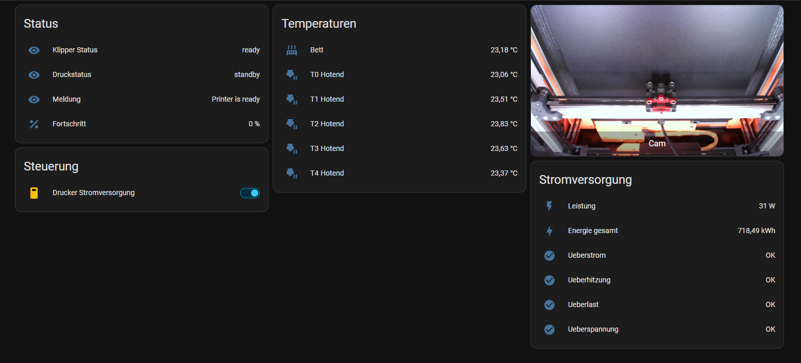
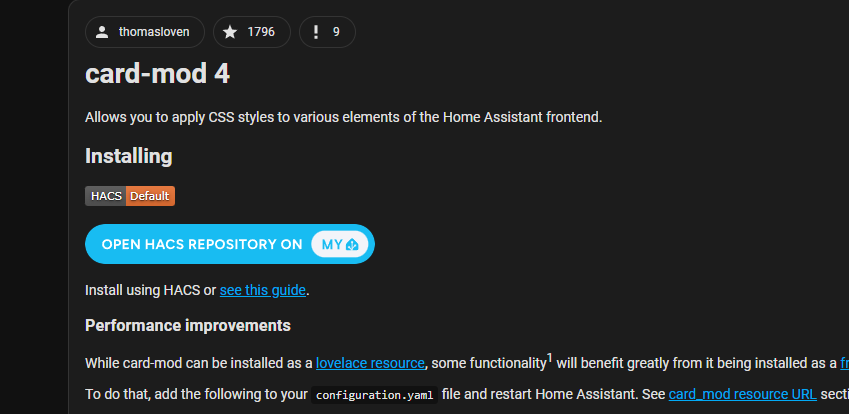
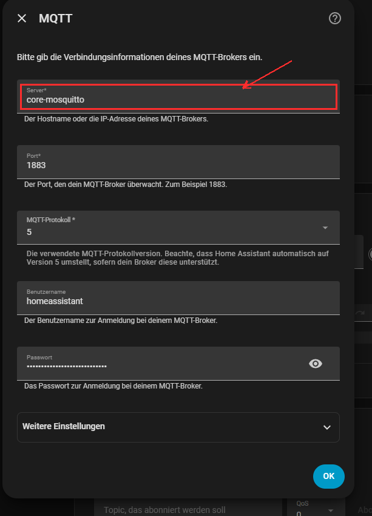
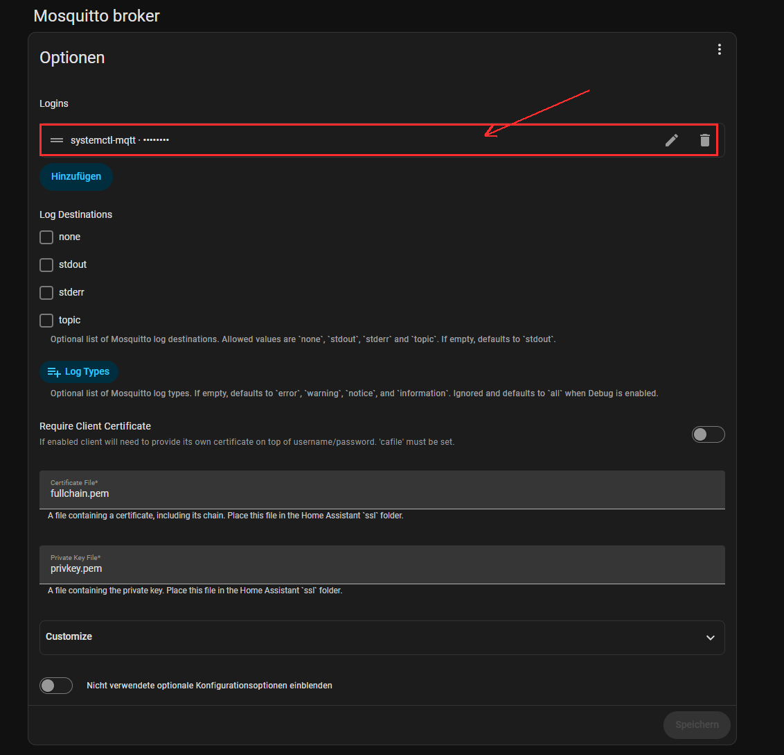
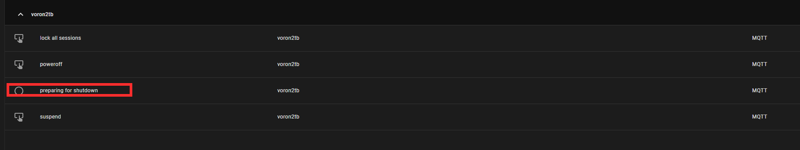
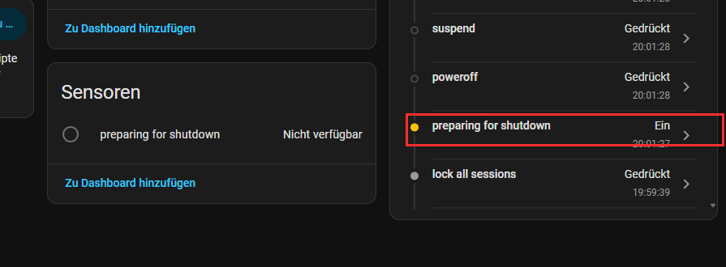
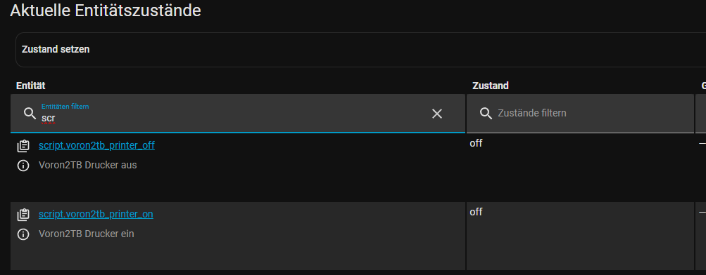

# Home Assistant Dashboard & Safe Auto-Shutdown

This guide builds a Home Assistant Lovelace dashboard for a Klipper/Moonraker
printer (status, temperatures, a rotated camera feed, and power control), plus
an automation that safely cuts mains power via a Shelly smart plug **a fixed
delay after a real shutdown is detected** — and never on a Wi-Fi hiccup.

All files referenced here live in [`home-assistant/`](../home-assistant/) in
this repository.

## Table of contents

1. [Prerequisites](#1-prerequisites)
2. [Dashboard](#2-dashboard)
3. [Manual power control (scripts)](#3-manual-power-control-scripts)
4. [Safe auto-shutdown detection](#4-safe-auto-shutdown-detection)
5. [Wiring it into `configuration.yaml`](#5-wiring-it-into-configurationyaml)
6. [Verifying everything works](#6-verifying-everything-works)
7. [Troubleshooting reference](#7-troubleshooting-reference)

---

## 1. Prerequisites

- Home Assistant already connected to the printer via the official
  Moonraker/Klipper integration (gives you `sensor.<printer>_*` entities for
  temperatures, status, etc.).
- A Crowsnest/Mainsail webcam already working.
- A Shelly (or similar) smart plug controlling the printer's mains power,
  already added to Home Assistant as a `switch.*` entity.
- The **MQTT integration** set up in Home Assistant, pointed at your actual
  MQTT broker (see section 4 — this is easy to get wrong if you also run a
  *second*, separate Mosquitto instance on the printer's own Pi).

## 2. Dashboard

The full dashboard is [`home-assistant/voron2tb_dashboard.yaml`](../home-assistant/voron2tb_dashboard.yaml) —
paste its `views:` content into a dashboard's raw YAML editor (**Settings →
Dashboards → (your dashboard) → ⋮ → Edit in YAML**), or merge just the
`cards:` list into an existing view.

Example of the resulting layout (status, temperatures, camera, power):



Highlights:

- **Power on/off tiles** — a `horizontal-stack` of two `type: tile` cards
  that call the scripts from section 3 directly on tap (`tap_action: →
  perform-action → script.turn_on`), with `hide_state: true` to hide the
  redundant "off" state text, and per-tile text colour set via `card_mod`
  (see note below).
- **Status / Temperatures** — plain `type: entities` cards against the
  Moonraker sensor entities.
- **Rotated camera** — a `type: picture-entity` card. If your camera feed is
  physically upside-down *only* from Home Assistant's perspective (Mainsail
  already shows it correctly, so the fix must not touch the stream itself),
  rotate it purely in the browser with [card-mod](https://github.com/thomasloven/lovelace-card-mod):

  ```yaml
  card_mod:
    style: |
      hui-image {
        transform: rotate(180deg);
      }
  ```

  Install card-mod via HACS first (search for **"card-mod"** by
  `thomasloven` — not "Card-Mod Studio", which is a separate visual editor
  built on top of it and not required here):

  

  Also set `tap_action: { action: none }` on the camera card — without it,
  the default tap-to-fullscreen behaviour can recreate the underlying image
  element on next page load and silently drop the `card_mod` styling.

- **Power tile info card** — plain `type: entities` card with the Shelly
  `switch.*` entity plus its power/energy sensors, and (once set up in
  section 4) the shutdown-detection `binary_sensor.*`.

## 3. Manual power control (scripts)

Two [scripts](../home-assistant/scripts_addition.yaml) provide manual
"printer on" / "printer off" buttons that do the right thing depending on
current state, instead of blindly toggling the plug:

```yaml
voron2tb_printer_off:
  alias: Voron2TB Printer Off
  sequence:
    - if:
        - condition: state
          entity_id: device_tracker.vorontallboi
          state: "home"
      then:
        - action: rest_command.voron2tb_host_shutdown
        - delay:
            seconds: 10
        - action: switch.turn_off
          target:
            entity_id: switch.voron_2_4_switch_0
      else:
        - action: switch.turn_off
          target:
            entity_id: switch.voron_2_4_switch_0

voron2tb_printer_on:
  alias: Voron2TB Printer On
  sequence:
    - if:
        - condition: state
          entity_id: switch.voron_2_4_switch_0
          state: "off"
      then:
        - action: switch.turn_on
          target:
            entity_id: switch.voron_2_4_switch_0
```

`rest_command.voron2tb_host_shutdown` calls Moonraker's shutdown endpoint
directly (see [`configuration_snippet.yaml`](../home-assistant/configuration_snippet.yaml)):

```yaml
rest_command:
  voron2tb_host_shutdown:
    url: "http://<PRINTER_PI_IP>:7125/machine/shutdown"
    method: POST
```

If Moonraker has `require_auth` enabled and Home Assistant's IP isn't listed
under `[authorization] trusted_clients` in `moonraker.conf`, add an
`X-Api-Key` header with a Moonraker API key instead.

## 4. Safe auto-shutdown detection

**The goal:** whenever a shutdown is triggered *any other way* — Mainsail's
"Host Shutdown" button, a touchscreen display, or `sudo shutdown` over SSH —
the Shelly plug should still switch off automatically a few seconds later,
without requiring the dashboard button above.

**The trap to avoid:** the naive approach is to watch a `device_tracker`
entity (network presence) and cut power once it goes `not_home`. **Don't do
this** — a brief Wi-Fi hiccup during an active print looks identical to a
real shutdown from a network-reachability standpoint, and would cut power to
a live print.

**The correct signal** comes directly from the operating system, not the
network: [systemd's `PrepareForShutdown` D-Bus signal](https://www.freedesktop.org/wiki/Software/systemd/logind/) fires
the instant *any* shutdown/reboot is requested, regardless of how — Mainsail,
a display, or the console — call it. It has nothing to do with network
reachability, so a Wi-Fi outage can never trigger it.

### 4.1 `systemctl-mqtt` on the printer's Pi

[`systemctl-mqtt`](https://github.com/fphammerle/systemctl-mqtt) is a small
daemon that subscribes to that D-Bus signal and publishes it (plus Home
Assistant MQTT auto-discovery config) to your MQTT broker. Install script:
[`home-assistant/systemctl-mqtt-install.sh`](../home-assistant/systemctl-mqtt-install.sh).

Run it **on the printer's Raspberry Pi** (not on the Home Assistant host —
it needs to observe *that* machine's systemd):

```bash
# edit MQTT_HOST / MQTT_USERNAME / MQTT_PASSWORD at the top of the script first
bash systemctl-mqtt-install.sh
```

Two details the script bakes in that are easy to get wrong by hand:

- **`--mqtt-disable-tls`** — `systemctl-mqtt` defaults to a TLS connection.
  Most home Mosquitto setups run plain, unencrypted MQTT on port 1883; without
  this flag the connection silently fails with `Connection refused`.
- **Point it at the *same* broker Home Assistant's MQTT integration actually
  uses.** If your printer's Pi happens to run its own local Mosquitto
  instance (e.g. for unrelated Shelly telemetry into Mainsail), that is a
  **separate broker** from the one Home Assistant is connected to — usually
  Home Assistant OS's own `core-mosquitto` add-on. Check **Settings → Devices
  & Services → MQTT → Configure** to see which broker Home Assistant is
  really using:

  

  Point `systemctl-mqtt`'s `--mqtt-host` at *that* address (e.g.
  `homeassistant.local`), not `localhost`.

### 4.2 A dedicated MQTT login

The `core-mosquitto` add-on's built-in `homeassistant` user is reserved for
Home Assistant Core's own internal connection to the add-on and may reject
external clients (`[code:135] Not authorized`) even with correct-looking
credentials. Add a separate login for `systemctl-mqtt` under **Settings →
Add-ons → Mosquitto broker → Configuration → Logins**:



Use that username/password in the `systemctl-mqtt` service instead, and
**restart the Mosquitto add-on** after adding it.

### 4.3 Confirming discovery worked

Once connected with the right host, TLS setting, and credentials,
`systemctl-mqtt` publishes Home Assistant MQTT-discovery messages
immediately — no manual "add device" step needed. Four entities appear
automatically under a device named after the printer's hostname:



The one that matters here is `binary_sensor.<hostname>_logind_preparing_for_shutdown`.

> If entities were created once but now show `unknown`/`unavailable` after a
> Home Assistant restart, reload the MQTT integration (**Settings → Devices &
> Services → MQTT → ⋮ → Reload**) *while* something is actively subscribed
> (e.g. `systemctl-mqtt` already running) — Home Assistant's "birth message"
> re-announcement is not retained by default, so a listener that starts too
> late misses it and has to wait for the next reload/restart cycle.

### 4.4 The automation

[`home-assistant/automations_addition.yaml`](../home-assistant/automations_addition.yaml):

```yaml
- alias: Voron2TB Auto-Shutdown Power Off
  trigger:
    - platform: state
      entity_id: binary_sensor.voron2tb_logind_preparing_for_shutdown
      to: "on"
  condition:
    - condition: state
      entity_id: switch.voron_2_4_switch_0
      state: "on"
  action:
    - delay:
        seconds: 10
    - action: switch.turn_off
      target:
        entity_id: switch.voron_2_4_switch_0
  mode: single
```

Confirmed working end-to-end: the sensor flips to `Ein` (on) the instant a
real shutdown starts, then the Shelly plug switches off automatically ~10
seconds later:



## 5. Wiring it into `configuration.yaml`

If your `configuration.yaml` already uses the standard
`automation: !include automations.yaml` / `script: !include scripts.yaml`
pattern (the Home Assistant default), **do not add a second `automation:` or
`script:` key** — YAML does not merge duplicate top-level keys, and Home
Assistant will refuse to restart with an error like:

```
Error loading /config/configuration.yaml: expected '<document start>', but
found '<block sequence start>' in "/config/automations.yaml", line 2, column 1
```

(That specific error also comes up if `automations.yaml` still contains the
default empty-list placeholder `[]` on its own line — remove that line before
appending real entries; a document can't contain both an empty flow-style
list and further block-sequence items.)

Instead:

- Add only `rest_command:` from
  [`configuration_snippet.yaml`](../home-assistant/configuration_snippet.yaml)
  directly to `configuration.yaml`.
- Append the two entries from
  [`scripts_addition.yaml`](../home-assistant/scripts_addition.yaml) to your
  existing `scripts.yaml` (no `script:` key inside that file — it *is* the
  value of that key).
- Append the one entry from
  [`automations_addition.yaml`](../home-assistant/automations_addition.yaml)
  to your existing `automations.yaml` (no `automation:` key inside that file
  either).
- Run **Developer Tools → YAML → Check Configuration** before restarting.
- Restart Home Assistant completely (a new `rest_command` needs a full Core
  restart, not just "reload automations").

## 6. Verifying everything works

- `script.voron2tb_printer_on` / `script.voron2tb_printer_off` exist and
  show state `off` (idle) after restart:

  

- The automation is listed under **Settings → Automations & Scenes**:

  

- Trigger a real shutdown (Mainsail button or touchscreen — not just `sudo
  shutdown` in an SSH session, to test the realistic case) and confirm the
  Shelly plug switches off roughly 10 seconds after
  `binary_sensor.<hostname>_logind_preparing_for_shutdown` flips to `on`.

## 7. Troubleshooting reference

| Symptom | Cause | Fix |
|---|---|---|
| `systemctl-mqtt` fails with `Connection refused` | TLS enabled by default, broker speaks plain MQTT | Add `--mqtt-disable-tls` |
| Still nothing arrives at the broker, even with TLS disabled | `systemctl-mqtt` was pointed at a *different* broker than the one HA's MQTT integration uses (e.g. `localhost` on the printer's Pi vs. HA's `core-mosquitto`) | Point `--mqtt-host` at the actual broker HA is connected to |
| `[code:135] Not authorized` | Used HA's internal `homeassistant` MQTT user, which is reserved for Core↔add-on traffic | Create a dedicated login in the Mosquitto add-on's Configuration → Logins |
| Entity exists but state stuck on `unknown`/`unavailable` | Home Assistant's MQTT birth message wasn't seen by `systemctl-mqtt` (not retained, wrong timing after a restart) | Reload the MQTT integration while `systemctl-mqtt` is already running/connected |
| `homeassistant.restart` service call fails, config check error mentioning `automations.yaml` line 2 | Duplicate `automation:`/`script:` keys in `configuration.yaml`, or a leftover `[]` placeholder line in `automations.yaml` | Keep `!include` in `configuration.yaml`; put new entries directly into `automations.yaml`/`scripts.yaml`; delete any stray `[]` line |
| Camera image rotates once but reverts to unrotated after a page reload | Default tap-action recreated the image element before `card-mod`'s style reapplied | Set `tap_action: { action: none }` on the picture-entity card |
| Rotating the camera in Home Assistant also rotated it in Mainsail | Rotation was applied at the source (Crowsnest/stream) instead of only in the browser | Use the `card_mod` CSS approach in section 2 instead of touching `crowsnest.conf` |
